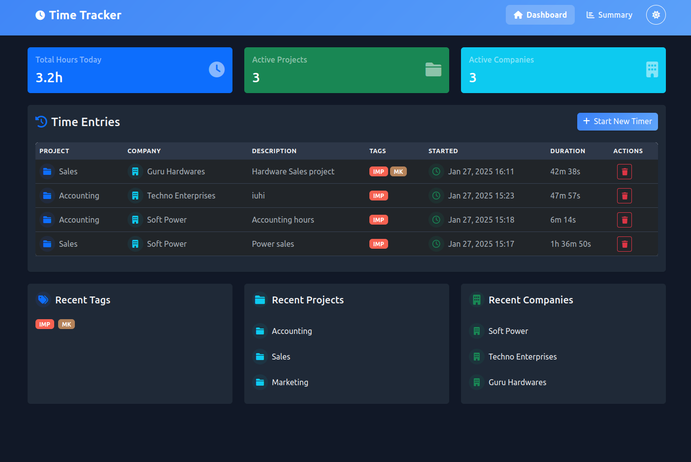
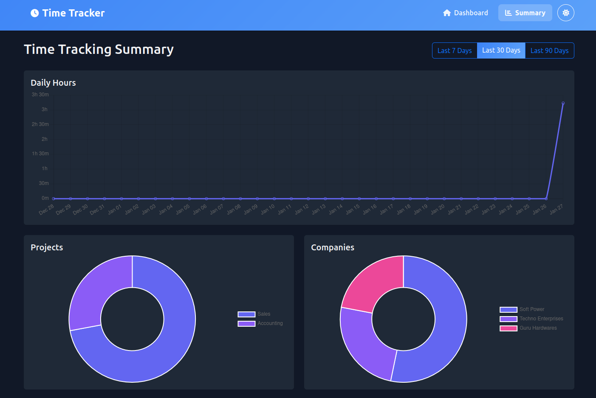

# ⏱️ Time Tracker

A modern, intuitive time tracking application built with Django. Track your work hours across different projects and companies with a beautiful, responsive interface.



## ✨ Features

- **📊 Real-time Time Tracking**
  - Start/stop timers for different tasks
  - Track time across multiple projects and companies
  - Add descriptions and tags to entries
  - Intuitive timer controls

- **📈 Comprehensive Analytics**
  - View time summaries for last 7, 30, or 90 days
  - Project-wise time distribution
  - Company-wise time allocation
  - Tag-based tracking
  - Interactive charts and visualizations

- **🎨 Modern UI/UX**
  - Clean, intuitive interface
  - Responsive design for all devices
  - Dark/Light mode support
  - Beautiful gradients and animations



## 🚀 Quick Start

### Using Docker

1. Clone the repository:
   ```bash
   git clone https://github.com/your-username/time-tracker.git
   cd time-tracker
   ```

2. Install Docker and Docker Compose

3. Run the application:
   ```bash
   docker compose up
   ```

4. Access the application at http://localhost:8000

5. Run the application:
   ```bash
   python manage.py runserver
   ```

6. Access the application at http://localhost:8000


## 🛠️ Development Setup

1. Clone the repository:
   ```bash
   git clone https://github.com/pimpalemahesh/time-tracker.git
   cd time-tracker
   ```

2. Create and activate a virtual environment:
   ```bash
   python -m venv venv
   source venv/bin/activate  # On Windows: venv\Scripts\activate
   ```

3. Install dependencies:
   ```bash
   pip install -r requirements.txt
   ```

4. Run migrations:
   ```bash
   python manage.py migrate
   ```

5. Create a superuser:
   ```bash
   python manage.py createsuperuser
   ```

6. Run the development server:
   ```bash
   python manage.py runserver
   ```

## 🤝 Contributing

Contributions are welcome! Please feel free to submit a Pull Request.

1. Fork the repository
2. Create your feature branch (`git checkout -b feature/AmazingFeature`)
3. Commit your changes (`git commit -m 'Add some AmazingFeature'`)
4. Push to the branch (`git push origin feature/AmazingFeature`)
5. Open a Pull Request

## 📝 License

This project is licensed under the MIT License - see the [LICENSE](LICENSE) file for details.

## 📧 Contact

Project Link: [https://github.com/pimpalemahesh/time-tracker](https://github.com/pimpalemahesh/time-tracker)

## 🙏 Acknowledgments

* [Django](https://www.djangoproject.com/)
* [Bootstrap](https://getbootstrap.com)
* [Font Awesome](https://fontawesome.com)
* [Select2](https://select2.org/)

Topics: django, time-tracking, project-management, analytics, bootstrap, chartjs
Description: A modern Django-based time tracking application with real-time tracking, beautiful analytics, and dark mode support. Track work hours across projects and companies with an intuitive interface and interactive visualizations. 🚀

# Time Tracker v1.0.0

First stable release of Time Tracker - A modern Django-based time tracking application.

## ✨ Features

### Core Functionality
- ⏱️ Real-time time tracking
- 📊 Project and company organization
- 🏷️ Tag-based task management
- 📈 Interactive analytics dashboard

### UI/UX
- 🌓 Dark/Light mode support
- 📱 Responsive design
- 📊 Interactive charts
- 🎨 Modern, clean interface

### Analytics
- 📅 7/30/90 days view options
- 📊 Project distribution charts
- 🏢 Company-wise analytics
- 🏷️ Tag usage statistics

## 🔧 Technical Details

- Django 5.1.5
- Python 3.11
- Bootstrap 5
- Chart.js
- Select2
- SQLite database

## 🚀 Installation

Detailed installation instructions are available in the README.md

## 🐛 Known Issues

None reported

## 🔜 Future Updates

- User authentication
- Export functionality
- Team collaboration features
- API endpoints

